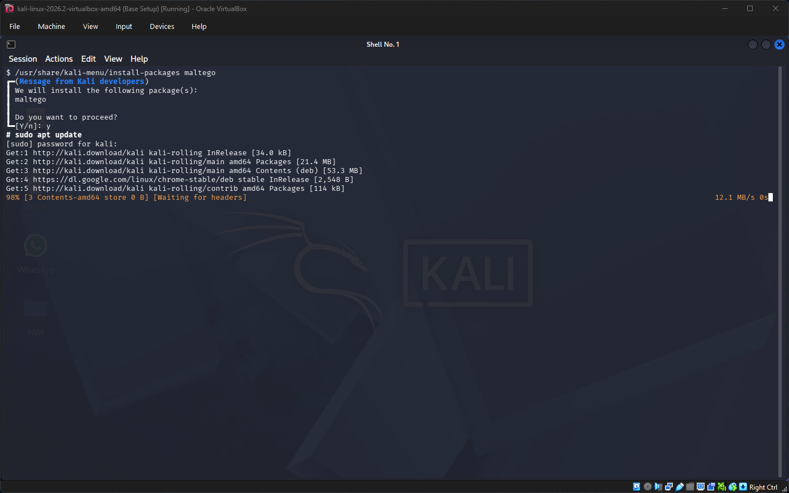
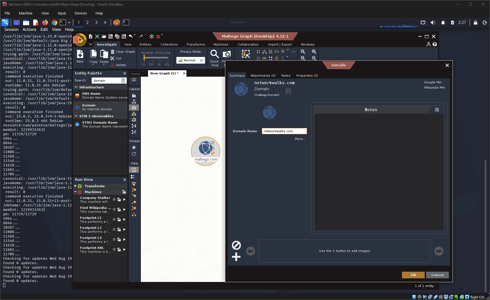
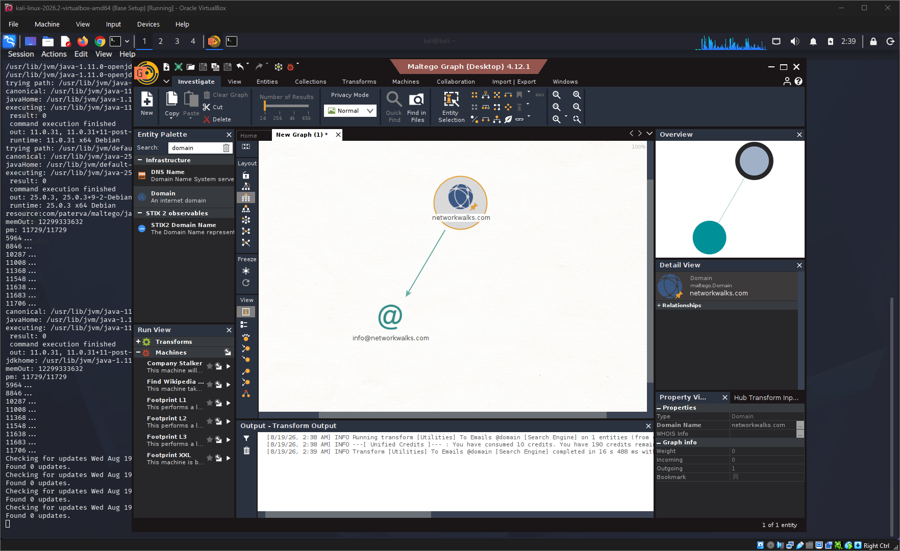
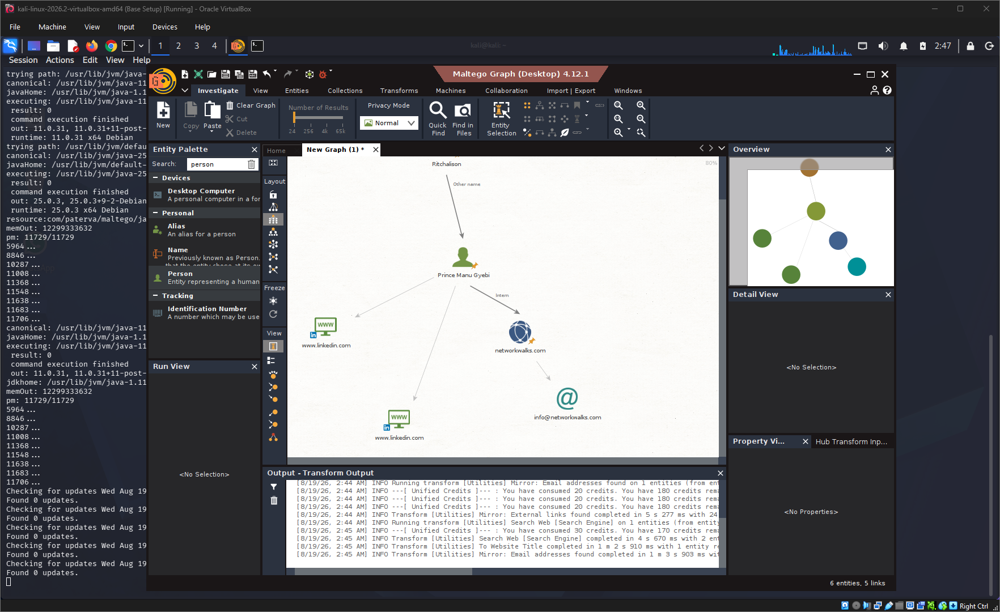

# OSINT Reconnaissance with Maltego

**NETWORKWALKS Cybersecurity Internship — Week 2, Project Module 3**

This project explored relationship-based OSINT reconnaissance using **Maltego Graph on Kali Linux**.

For the W2-PM3 exercise, I investigated the internship-scoped `networkwalks.com` domain. Starting with a Domain entity, I used Maltego transforms to query available data sources, which returned `info@networkwalks.com` as an email entity associated with the domain.

After completing the required task, I continued experimenting with additional entities and transforms to observe how the investigation could expand through successive pivots.

## Project Summary

| Item | Details |
|---|---|
| Module | W2-PM3 — Maltego-based Footprinting |
| Tool | Maltego Graph (Desktop) 4.12.1 |
| Edition | Community Edition |
| Platform | Kali Linux 2026.2 |
| Environment | Oracle VirtualBox |
| Technique | Passive OSINT / Footprinting |
| Target | `networkwalks.com` — internship-scoped target |
| Primary Task | Identify email addresses associated with the target domain |
| Result | `info@networkwalks.com` returned as an email entity |
| Additional Work | Expanded the graph using further entities and transforms |

## Maltego Concepts

Maltego is an OSINT and link-analysis platform that represents information as **entities and relationships** within a visual graph.

Entities can represent domains, email addresses, people, websites, IP addresses, DNS records, organisations and other information.

The primary relationship returned during this exercise was:

```text
networkwalks.com
       |
       v
info@networkwalks.com
```

With two entities, the relationship is straightforward. Graph-based analysis becomes more useful as the number of entities and relationships grows.

### Transforms

A **transform** takes an existing entity as input, performs a defined lookup or queries an available data source, and returns related entities that can be added to the graph.

Conceptually:

```text
Known Entity
     |
     v
 Transform
     |
     v
Related Entity
     |
     v
Next Pivot
```

A returned entity can then become the starting point for another transform, allowing an investigation to expand progressively.

## Environment & Tools

- **Kali Linux 2026.2** — operating environment
- **Oracle VirtualBox** — virtualisation platform
- **Maltego Graph (Desktop) 4.12.1** — OSINT and link-analysis platform
- **Maltego Community Edition** — edition used for the exercise

## Methodology

### 1. Installing Maltego on Kali Linux

Although the internship material demonstrated Maltego using Windows, I completed the exercise using Kali Linux.

Maltego was installed through Kali's package management system and launched successfully without significant configuration issues.




### 2. Establishing the Starting Entity

I created a **Domain** entity and set its value to:

```text
networkwalks.com
```



This provided the starting point from which relevant transforms could be executed.

### 3. Selecting the Email Transform

With the Domain entity selected, I chose the **Email addresses from Domain** option.


The transform used was:

```text
[Utilities] To Emails @domain [Search Engine]
```

The transform queried its available data source and returned the resulting entity directly into the graph.

### 4. Transform Result

The transform returned one email entity associated with the target domain:

```text
info@networkwalks.com
```



The graph represented the relationship as:

```text
networkwalks.com
       |
       v
info@networkwalks.com
```

The useful distinction was not simply the returned email address, but Maltego's ability to preserve and visualise the relationship between the entities.

## Going Beyond the Required Task

After completing the required Domain-to-Email task, I explored additional entities and transforms to observe how a Maltego investigation can expand through successive pivots.



The broader graph contained additional web- and person-related entities connected during the exploration.

Each entity can potentially become another investigative starting point:

```text
Known Entity
     |
     v
 Transform
     |
     v
New Entity
     |
     v
Further Investigation
```

The expanded graph reflects exploratory work; not every displayed entity was returned directly from the original `networkwalks.com` domain transform.

## Results

| Activity | Result |
|---|---|
| Maltego installation | Successful on Kali Linux |
| Community Edition setup | Completed without significant issues |
| Initial entity | `networkwalks.com` |
| Entity type | Domain |
| Email transform | Completed successfully |
| Email entities returned | 1 |
| Returned email entity | `info@networkwalks.com` |
| Additional exploration | Broader relationship graph generated |

The required task was completed by using a Domain entity and an email-related transform to return an associated email entity and visualise the relationship within Maltego.

## Key Observations

- Maltego's main value is not simply discovering information, but visualising relationships between entities.
- Transforms allow an investigation to progress iteratively by using discovered entities as new pivot points.
- Graph-based analysis becomes increasingly useful as the number of entities and relationships grows.
- Transform results depend on the underlying data sources and available query capabilities.
- A returned OSINT entity should not automatically be treated as a security vulnerability or verified security issue.

```text
Discovered Information
        ≠
Security-Relevant Exposure
        ≠
Validated Vulnerability
```

Further analysis and authorised testing would be required before making stronger security claims.

## Skills Used

- Passive OSINT reconnaissance
- Maltego Graph
- Maltego entities and transforms
- Domain-based footprinting
- Email-address enumeration
- Relationship and link analysis
- Investigative pivoting
- Kali Linux
- Technical evidence collection
- Interpretation of OSINT findings

## Resources & Acknowledgements

The W2-PM3 Maltego exercise was completed using the walkthrough and practice guidance provided by **Waqas Karim (CCIE)**, instructor for the NETWORKWALKS Cybersecurity Internship Programme.

### Reference

- [Maltego Installation + Setup || Practice Lab 1](https://youtu.be/v0eqeYJ5PKc)

## Ethical Use & Scope

This activity was completed for educational purposes as part of the **NETWORKWALKS Cybersecurity Internship Programme, Batch B082**.

Reconnaissance was limited to the internship-scoped `networkwalks.com` domain and publicly accessible information returned through Maltego transforms.

The presence of an email address, person, website or other entity in an OSINT graph does not by itself indicate a security vulnerability.

No exploitation, unauthorised access, credential attacks or destructive testing was performed.

## Repository Structure

```text
.
├── screenshots/
│   ├── 01-maltego-installation-on-kali.png
│   ├── 02-maltego-community-edition-kali.png
│   ├── 03-networkwalks-domain-entity.png
│   ├── 04-email-transform-selection.png
│   ├── 05-email-address-transform-result.png
│   └── 06-additional-transform-exploration.png
└── README.md
```

## Author

**Prince Manu Gyebi**  
Cybersecurity Intern — Batch B082  
NETWORKWALKS

LinkedIn: [Prince Manu Gyebi](https://www.linkedin.com/in/princemanugyebi)
